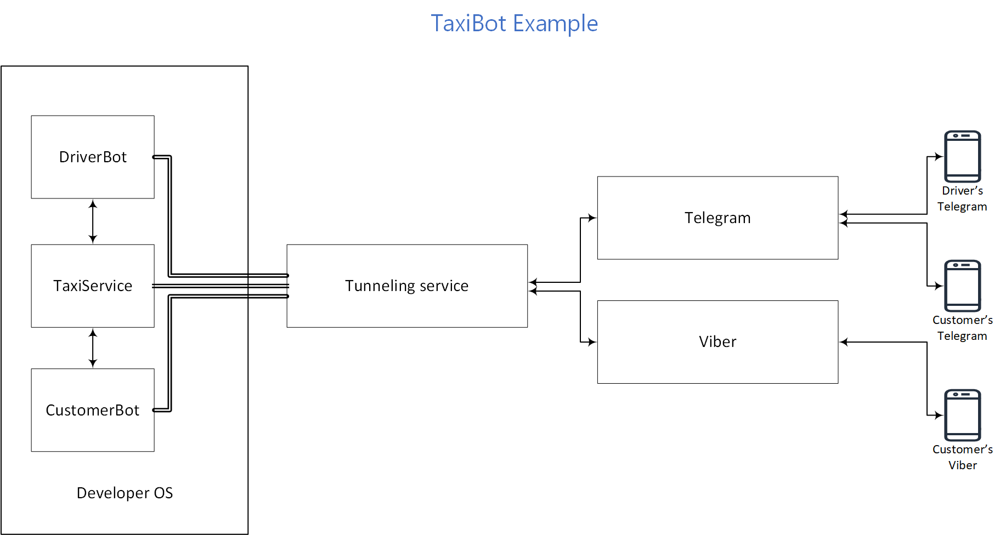
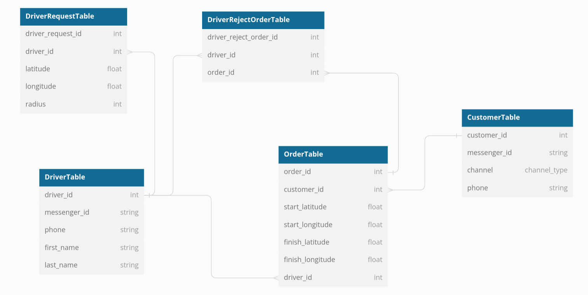

# Taxi Example

`Taxi Example` is the simplest service to order a taxi. The service allows the customer to get to the right place quickly, and the drivers provide a constant flow of orders.

The customer orders a taxi through `CustomerBot`, specifying:

* pick up location,
* destination point.

The driver provides through the `DriverBot`:

* phone number/name on the first visit (registration),
* location,
* radius in which the taxi service is provided.

`TaxiService` service based on these data finds the best driver on the customer's order.

The service includes three roles:

The customer, `CustomerBot`:

 * creates the order,
 * searches for a driver,
 * manages the state of the trip.

The driver, `DriverBot`:

 * starts working (informs the system that he works and determines the geography of orders),
 * stops working (tells the system that he has finished working),
 * accepts the order,
 * rejects the order,
 * informs about the waiting for the customer,
 * informs about the beginning of the trip,
 * informs about the end of the trip,
 * reports readiness for new trips.

The system, `TaxiService`:

 * registers the customer,
 * registers the driver,
 * calculates the trip distance and cost,
 * connects customer and driver,
 * registers the start/end of the driver's work,
 * registers and monitors the state of the trip,
 * cancels the trip,
 * looking for suitable drivers,
 * sends offers to drivers for the trip,
 * registers the agreement/disagreement to make a trip by the driver.


The customer's role is implemented as a chat-bot for two channels  `Viber` and `Telegram`.
The driver's role is implemented as a separate chat-bot in `Telegram`.
The system's role is implemented as a separate `REST API` application.

The general scheme of the service is shown below:
<p align="center">
  
</p>


# Requirements
Before you start, you should make sure that the system has:

* Python 3.9 - 3.11,
* Git,
* [Poetry](https://python-poetry.org/),
* [Pagekite](https://pagekite.net/downloads).
  We recommend to just download pagekite.py and use it as a separate scenario.
  ```bash
  curl -O https://pagekite.net/pk/pagekite.py
  ```

It's also required:

* To register and receive a token for the [Routing Service](https://openrouteservice.org/),
* To create two bots in `Telegram`: driver’s chat and customer's chat: see BotFather and [instruction](https://core.telegram.org/bots/tutorial),
* To create a `Viber` bot for customer: see [instruction](https://developers.viber.com/docs/api/rest-bot-api/#get-started).

**Note** You'll need a smartphone with `Telegram` and `Viber` apps to work properly. Desktop versions of `Telegram` and `Viber` do not fit, as they don't allow you to send the location.

# Install
Clone this repository and change current directory
```bash
git clone https://github.com/maxbot-ai/taxi_bot
cd taxi_bot
```

Install the package with dependencies
```bash
poetry shell
poetry install
```

# TaxiService

The service implements the entire business logic of the project:

* registers the driver and customers,
* calculates the trip distance and cost,
* builds the route,
* connects customer and driver,
* monitors the state of the trip.


## Interaction with external services

Below is a scheme of the service with some details that will be used to customize the example.
<p align="center">
  
</p>

- To handle incoming requests from `DriverBot` and `CustomerBot` `TaxiService` provides `HTTP REST API` (it is a server). The `bind_port` parameter sets the port which `TaxiService REST API` will use. The address and port must be set in the startup parameters of `DriverBot` and `CustomerBot`. The file in which `bind_port` is set and the commands to start the bots are described below.

- `REST API` is also used to transfer data to `DriverBot` and to `CustomerBot`. In this case `TaxiService` is the client. The `driver_bot_url` and `customer_bot_url` parameters in `taxi_bot.conf` file are responsible for this. These URLs can be either local (localhost) or external when using tunnels.

- The external service [openrouteservice.org](https://openrouteservice.org) is used to generate a map and calculate travel distances. The service supports access via `HTTP REST API`. `TaxiService` is a client. To work with the service you need to register for free and get the access key. See [instructions](https://openrouteservice.org/dev).
The `openrouteservice_token` parameter defines a key for using the route building API. This setting is set in the file `taxi_bot.conf`.

## Setup

To configure the service, save the file `taxi_bot.conf.template` with the name `taxi_bot.conf`.
```bash
cp taxi_bot.conf.template taxi_bot.conf
```

Next, open the `taxi_bot.conf` file in your favorite editor and set the actual values for all parameters:

* `bind_port` — port on which `TaxiService` will wait to incoming `HTTP` requests. For example, `6010`. Requests from `CustomerBot` and `DriverBot` will be received on this port.
* `openrouteservice_token` — token to access the [openrouteservice.org](https://openrouteservice.org) service. Free registration is required to obtain the key. See [instructions](https://openrouteservice.org/dev).
* `driver_bot_url` — address for interaction with `DriverBot`. For example, `http://localhost:6011`.
* `customer_bot_url` — address for interaction with `CustomerBot`. For example, `http://localhost:6012`.
* `image_storage_url` — external address where `TaxiService` should be available. The external address is required in order to send pictures to `Telegram` and `Viber`. You can use [pagekite](https://pagekite.net/) or [ngrok](https://ngrok.com/) to get the external address and forward it to the local port of `TaxiService`. See examples of launches below.
* `upload_file_path` — full path to the directory where the maps of the built trips will be saved. For example, `/tmp`.

## Launch

* We will use [pagekite](https://pagekite.net/) to get an external address and create a tunnel to the `TaxiService`. You can use any other similar utility, such as [ngrok](https://ngrok.com/) or setup communication through `reverse-proxy`.

* If you use [pagekite](https://pagekite.net/), you need to register and specify the subdomain to be used to create the tunnel. For example, `taxiexample.pagekite.me`.

* Run `pagekite`. Set `bind_port`, for example `6010` and specify the desired external address (it shouldn't be occupied by another person, if there is an error, then come up with a different name). For example,
  ```
  python3 pagekite.py 6010 taxiexample.pagekite.me
  ```
  Then follow the instructions at the `pagekite` command line.
  As a result, `pagekite` should create a tunnel. You should see the following line in console:
  ```
  <> Flying localhost:6010 as https://taxiexample.pagekite.me/
  ```

* Create a directory to store routing files. For example, ```/home/user_name/tmp/``` or use ``/tmp`` if access rights allow. And don't forget to write the full path in the `taxi_bot.conf` file, `upload_file_path` parameter.

* Make sure that you are in the `taxi_bot` directory.

* Run the service with the command
  ```
  taxi_bot --config taxi_bot.conf
  ```


# DriverBot

The bot implements the interaction between the driver and `TaxiService`. It provides the following features:

* driver registration,
* confirmation and cancellation of the trip,
* trip execution.

## Interaction with external services

* The bot supports the `Telegram` channel. Interaction with the `Telegram` service is realized through the `WebHooks` mechanism. You should have an external address to register `WebHook`. See the Launch section.
* `DriverBot` transfers data to `TaxiService` via `REST API`. The `DriverBot` is a client. The address to access is set in the bot settings. See the Setup section, `TAXI_BOT_API` parameter.
* `DriverBot` receives data from `TaxiService` via `REST API` too. The `DriverBot` is the server. See the `port` parameter in the `DriverBot` start command below.

## Setup

To configure the bot, save the file `env.template` with the name `.env` in the `taxi_bot` directory. Оpen file `.env` in your favorite editor and set the actual values for all parameters:

* `TELEGRAM_DRIVER_API_KEY` — the token of `Telegram` bot, that will become `DriverBot`.
* `TELEGRAM_CUSTOMER_API_KEY` — the token of `Telegram` bot, that will become `CustomerBot` in `Telegram`.
* `VIBER_CUSTOMER_API_KEY` — the token of `Viber` bot, that will become `CustomerBot` in `Viber`.
* `TAXI_BOT_API` — address of the `TaxiService` service. Specify `http://127.0.0.1:6010`, if you used this value when configuring `TaxiService`.

All fields are required in the current version of the bot.

## Launch

* In the [pagekite control panel](https://pagekite.net/home), add the `kite` to create another tunnel. For example, `driver-taxiexample.pagekite.me`. To do this, click the `add kite` button.
* Make sure you are in the `taxi_bot` directory.
* Select the port for `DriverBot`, for example, `6011`.
* Run the bot with the command
  ```
  maxbot run --bot taxi_bot.bot:driver --updater=webhooks --host=localhost --port=<BIND_PORT> --public-url=<DRIVER_BOT_PUBLIC_URL>
  ```
  In our particular example:
  ```
  maxbot run --bot taxi_bot.bot:driver --updater=webhooks --host=localhost --port=6011 --public-url=https://driver-taxiexample.pagekite.me
  ```
* Run `pagekite`. Set the port and the external address. For example,
  ```
  python3 pagekite.py 6011 driver-taxiexample.pagekite.me
  ```
* Make sure that `pagekite` has started successfully and created a tunnel.


# CustomerBot

The bot implements the interaction between the customer and `TaxiService`. It provides the following features:

* customer registration,
* ordering a taxi,
* change the status of the trip.


## Interaction with external services

* The bot supports the `Telegram` and the `Viber` channels. Interaction with these services is realized through the `WebHooks` mechanism. You should have an external address to register `WebHook`. See the Launch section.
* `CustomerBot` transfers data to `TaxiService`  via `REST API` as well as the `DriverBot`. See the appropriate section.
* `CustomerBot` receives data from `TaxiService` via `REST API` as well as the `DriverBot`. See the appropriate section.

## Setup

See the appropriate section for the `DriverBot`.


## Launch

* In the [pagekite control panel](https://pagekite.net/home), add the `kite` to create another tunnel. For example, `customer-taxiexample.pagekite.me`. To do this, click the `add kite' button.
* Select the port for `CustomerBot`, for example, `6012`.
* For `CustomerBot` it is important to create the tunnel first, and then run the bot (due to the features of Viber and pagekite). Run pagekite. Set the port and the external address, for example,
  ```
  python3 pagekite.py 6012 customer-taxiexample.pagekite.me
  ```
* Make sure that `pagekite` has started successfully and created a tunnel on `bind_port`.
* Make sure you are in the `taxi_bot` directory.
* Run the bot with the command
  ```
  maxbot run --bot taxi_bot.bot:customer --updater=webhooks --host=localhost --port=<BIND_PORT>\ --public-url=<CUSTOMER_BOT_PUBLIC_URL>
  ```
  In our particular example:
  ```
  maxbot run --bot taxi_bot.bot:customer --updater=webhooks --host=localhost --port=6012 --public-url=https://customer-taxiexample.pagekite.me
  ```

# Testing

After successfully launching `TaxiService`, `DriverBot` and `CustomerBot` you can test the example. Text `DriverBot` and `CustomerBot` via `Telegram` and follow the hint.


# Implementation details

This example shows the details of the implementation:

- using an external `HTTP` service,
- interacting with an external `HTTP` service through the ```REST``` command,
- database schema,
- customer settings in the channel, `dialog` variable,
- adding new commands to channels using `mixin`,
- using of `RPC` requests to notify bots from external `HTTP` service,
- working with several channels (`Telegram` and `Viber`) in `CustomerBot`,
- running tests,
- adding dependencies.


## Using an external HTTP service

* An external `HTTP` service in python is used to implement business logic: `TaxiService`.
* The `taxi_bot/api_service` folder and the file are used for starting `taxi_bot/cli.py`.
* It is accessed from bots using the REST external `HTTP` calls function (see below).
* There is also a feature for external services to notify bots via `HTTP` queries: `RPC` (see below).

## Interacting with an external HTTP service

The `REST` command is used to interact with an external service; it performs `HTTP` requests.
It is necessary to add the external service setting to the bot's scenario.

Example:
```yaml
extensions:
    rest:
       services:
         - name: taxi_service
           base_url: http://taxi.service.net
           timeout: 10
    ...
```

Or you can specify the address via the environment settings:
```yaml
    ...
           base_url: !ENV ${TAXI_BOT_API}
    ...
```
The `TAXI_BOT_API` variable must be specified in the file `taxi_bot/.env`
You can specify more than one external service; each service must have a unique value of `name`.

Example of using an external service with the `REST` command:
```yaml
       response: |-
          
```
This command sends a `HTTP` request (POST) `http://taxi.service.net/{channel_name}/{user_id}` with the JSON body.
See the `dialog` variable below.

## Database schema

<p align="center">
  
</p>

## Customer settings in the channel, `dialog` variable

You can get the information about the customer from the bot scenario using `dialog` variable.
The following parameters are available:

- customer channel name: `dialog.channel_name` it is `Telegram` or `Viber` in this example
- customer ID in the channel: `dialog.user_id` is a unique string value within the channel

**Note**
- The pair (`dialog.user_id`, `dialog.channel_name`) is unique for each customer, it is used to store data about customers in this example
- Only one channel (`Telegram`) was created for drivers, so it is enough to use `dialog.user_id` to work with them

## Using RPC requests

Sometimes you need the bot to respond to events, taking place in an external `HTTP` service, not as a reaction to messages from customers.
The `RPC` feature is made to receive and process such events. This is the ability of the bot scenario
to receive and process `HTTP` requests. Each request must be described in the `RPC` block.

Example of configuration:
```yaml
rpc:
  - method: arrival
    params:
      - name: order
        required: true
```

Example of processing:
```yaml
      - condition: rpc.driver_arrived and slots.order_id == params.order_id
        response: |-
          <jump_to node="waiting_start_ride" transition="response" />
```
It is used to notify that a driver has arrived at the customer in `CustomerBot`.
The event that happened in `DriverBot` via an external `HTTP` service and the `RPC` feature comes to `CustomerBot`.

## New commands for messengers (mixin)

- `mixin` is used to add features to communicate with `Telegram` and `Viber` messengers
- the `channels` folder contains the implementation of additional features of channels: work with buttons, locations and contacts

### ```ContactMixin``` to get contact (phone number and name) from drivers and customers

- `Telegram` [documentation](https://core.telegram.org/bots/api#contact)
- `Viber` [documentation](https://developers.viber.com/docs/api/rest-bot-api/#contact-message)

Example of usage in scenario:
```yaml
      - condition: message.contact
        response: |-
          phone={{message.contact.phone_number}}
          first_name={{message.contact.first_name}}
          last_name={{message.contact.last_name|default('')}}
```

**Note** The `Viber` does not have the `first_name` and the `last_name` parameters, but has the `name` parameter.
It comes in the `message.contact.first_name variable`, while `message.contact.last_name` is always empty, equal to `none`.

**Note** The last_name parameter can also be empty in `Telegram`.


### ```KeyboardButtonContactMixin``` to send contacts by pressing button in messenger

- `Telegram` [documentation](https://core.telegram.org/bots/api#keyboardbutton)
- The ```request_contact``` parameter is used in implementation for `Telegram`
- `Viber` [documentation](https://developers.viber.com/docs/tools/keyboards/#buttons-parameters)
- The ```ActionType=share-phone``` parameter is used in implementation for `Viber`

Example of using in bot scenario:
```yaml
    response: |-
      <keyboard_button_contact title="Send your phone" text="Please, send me your contact." />
```


### ```LocationMixin``` to receive and send messages with a location

- `Telegram` [documentation](https://core.telegram.org/bots/api#location)
- `Viber` [documentation](https://developers.viber.com/docs/api/rest-bot-api/#location-message)
- The `horizontal_accuracy` parameter determines the map scale when displaying the map in messenger, its value is chosen empirically.

Example of using in bot scenario:
```yaml
     - condition: message.location
       response: |-
         latitude={{message.location.latitude}}
         longitude={{message.location.longitude}}
         <location latitude="{{ message.location.latitude }}"
                   longitude="{{ message.location.longitude }}"
                   horizontal_accuracy="5"/>
```


### ```KeyboardButtonLocationMixin``` to send the current location by pressing button in messenger

- `Telegram` [documentation](https://core.telegram.org/bots/api#keyboardbutton)
- The ```request_location``` parameter is used in implementation for `Telegram`
- `Viber` [documentation](https://developers.viber.com/docs/tools/keyboards/#buttons-parameters)
- The ```ActionType=location-picker``` parameter is used in implementation for `Viber`

Example of using in bot scenario:
```yaml
    response: |-
      <keyboard_button_location text="Submit your location." title="My location" />
```


### ```KeyboardButtonListMixin``` to send a list of buttons with any text

Used to select an option from the list or to prevent the customer from writing text.


- `Telegram` [documentation](https://core.telegram.org/bots/api#keyboardbutton)
- `Viber` [documentation](https://developers.viber.com/docs/tools/keyboards/#buttons-parameters)

Example of using in bot scenario:
```yaml
    response: |-
      <keyboard_button_list text="Click start or change route:" >
         <buttons>start route</buttons>
         <buttons>change route</buttons>
      </keyboard_button_list>
```


### ```KeyboardButtonRemoveMixin``` to remove buttons


- `Telegram` [documentation](https://core.telegram.org/bots/api#replykeyboardremove)
- The `InputFieldState=hidden` parameter is used in implementation for `Telegram`
- `Viber` [documentation](https://developers.viber.com/docs/tools/keyboards/#general-keyboard-parameters)
- The `ActionType=none` parameters is used in implementation for `Viber`


**Note** If you want to remove the chat buttons, you need to use the `KeyboardButtonRemoveMixin`, otherwise
buttons will not disappear after sending a new message.

**Note** The message with the button removal command should contain text: it will be sent as a text message.


Example of using in bot scenario:
```yaml
    response: |-
      <keyboard_button_remove text="Ride started" />
```

## Working with multiple channels

`CustomerBot` uses two channels: `Viber` and `Telegram`. The example demonstrates
the ability to work with multiple messengers in the same scenario.

## Running tests
```bash
poetry shell
poetry install (if not previously installed)
poetry run pytest tests/
```

## Adding dependencies

The external python service contains a number of dependencies that need to be installed.
To do this, add these dependencies to the `pyproject.toml` file:
```
[tool.poetry.dependencies]
python = ">=3.9, <3.12"
maxbot = "^0.2.0b2"
click-config-file = {version = "^0.6.0"}
Flask-SQLAlchemy = {version = "^3.0.2"}
...
```

The `maxbot` dependency should be in all examples.
The `tool.poetry.group.dev.dependencies` section lists dependencies to run unit tests ,
in this example it is:
```
[tool.poetry.group.dev.dependencies]
pytest = "^7.2.0"  (for pytest based unit tests)
httpretty = "^1.1.4" (mock library for `HTTP` modules)
```
